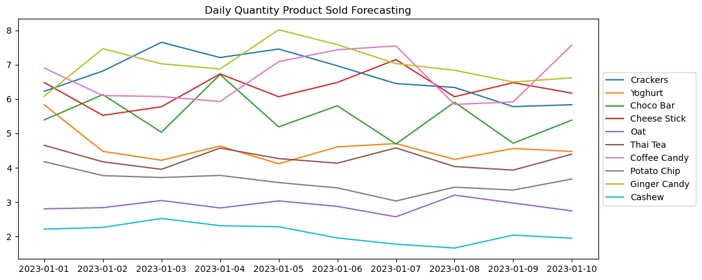

# Forecast the Future Demand of Product by Utilizing Machine Learning
my project involves using ARIMA (AutoRegressive Integrated Moving Average) forecasting to predict daily product sales. The Inventory Team faces challenges in accurately anticipating daily demand, which often leads to inefficient stock management and potential stockouts. The primary objective of this project is to develop ARIMA models based on historical sales data to forecast future daily product sales accurately. By leveraging these forecasts, the Inventory Team will be equipped to optimize inventory levels, ensure sufficient stock availability, and minimize carrying costs. Ultimately, this ARIMA forecasting project aims to enhance the Inventory Team's decision-making processes, leading to improved inventory management, reduced stock-related issues, and increased overall efficiency in the company's supply chain.
 
  You can connect with me on <a href="https://www.linkedin.com/in/lanafuadi/">LinkedIn.</a>.

  
   
  Image by <a href="https://www.linkedin.com/in/lanafuadi/details/projects/"> Lana Fuadi</a>

